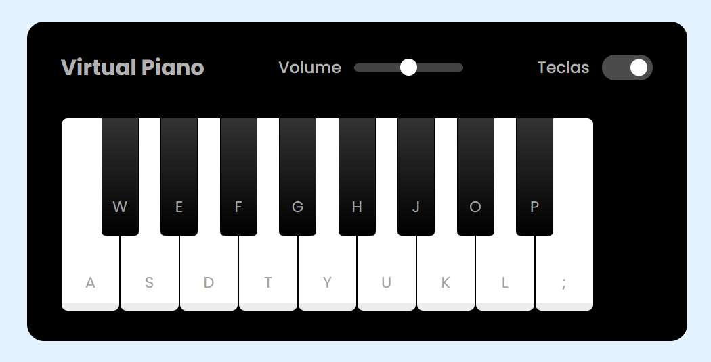

## Treinando um pouco de html, css e js construindo um piano virtual.

### [Experimente o piano aqui](https://brunamotta.github.io/piano-js/)

**Alguns conceitos trabalhados:**

- manipulação do dom
- eventListeners
- tratar elementos html
- adicionar classes dinamicamente
- pseudoelementos
- estilizar elementos input
